# Three of a Kind Game

Three of a Kind Game it was developed with the intention to entertain the user/player, and force him/her to use his/her memory to make better decisions. It is a card game where the player faces the computer. Each player (user/computer) receives 4 cards, in each round has to discard an unwanted card and draw a new one from two options, current deck game (hidden) or discard deck (revealed), being able to take only the top card. The player who gets 3 of the same cards wins.

The game is deployed on Heroku and is strictly terminal-based for user interaction.

- Here is the link to the final project > [Three of a Kind Game](https://three-of-a-kind-game.herokuapp.com/)

RESPONSIVE IMAGE HERE

## Contents

    
Summary

- [UX/UI Design](#uxui-design).
     * [Strategy](#strategy).
     * [Scope](#scope).
     * [Structure](#structure).
     * [Skeleton](#skeleton).
       * [Flowchart](#flowchart).
     * [Surface](#surface).
       * [Colour scheme](#colour-scheme).
       * [Typography](#typography).
       * [Imagery](#imagery).
   
- [Features](#features).
   * [Existing Features](#existing-features).
     * [Home page](#home-page).
     * [Converter page](#converter-page).
     * [Quiz game page](#quiz-game-page).
   * [Features Left to Implement](#features-left-to-implement).
 
- [Testing](#testing).
   * [Funcionality](#funcionality).
   * [Navegation and Devices](#navegation-and-devices).
   * [Validator Testing](#validator-testing).
   * [Performance Testing](#performance-testing).
   * [Other Tests](#other-tests).
   * [User Story Testing](#user-story-testing).
   * [Fixed Bugs](#fixed-bugs).
   * [Unfixed Bugs](#unfixed-bugs).
 
- [Deployment](#deployment).
   * [Deployment](#deployment).
   * [Fork](#fork).
   * [Clone](#clone).
  
- [Technologies and tools](#technologies-and-tools).

- [Credits](#credits). 
   * [Content](#content).
   * [Media](#media).
   * [Inspiration](#inspiration).
 
- [Acknowledgements](#acknowledgements).
 

 

## UX/UI Design

### Strategy

#### Site owner goals

- The game targets those who are excited by card games and challenges. The game was designed to be a good hobbie and an alternative way to train your mind. People who are interested in different games and games that involve cards could be a potential audience.

#### User stories

- As a user, I want to understand the purpose of the website, so I can know if it's of interest to me.
- As a user, I want to easily navigate the site/game, so I don't get lost trying to navigate/play.
- As a user, I want to be able to check my points and those of my opponent, to know my performance.
- As a user, I want to be able to restart/quit the game, if it is in my interest to start again for some reason.

### Scope

For Three of a Kind Game I have planned the following features.
	- Use of the python language efficiently to make the game dont show any problems.
	- Through the terminal-based, display as clearly as possible the cards and dynamics of the game

### Structure

The Three of a Kind Game structure is based on a single static web page with the terminal-based to run the game.

### Skeleton

#### Flowchart

- The flowchart was elaborated to guide the development of the game steps.

Flowchart

FLOWCHART IMAGE HERE

### Surface

#### Colour scheme

- To make the game more intuitive and to highlight certain aspects such as suits, selection options or to highlight one information differently from another. I chose to use ANSI colors in the terminal.

## Features

This project consists of a single page with the layout and configuration provided by the Code Institute, this template was dedicated to Heroku deployment. The program will be executed in a terminal.

### Existing Features

#### __Main menu__

- When you start the program, the main menu is displayed. In which the name of the game/project appears in yellow followed by the initial options for the player to run. These are: __[P]__ to play, __[R]__ to show the rules, and __[Q]__ to close the program.

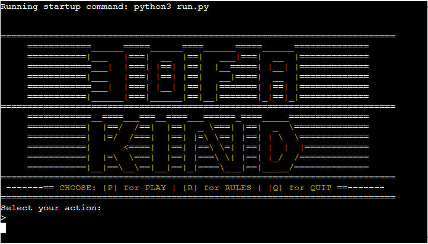

#### __Rules__

- When selecting the rules, the terminal will show a list containing gameplay instructions and the objective of the game.

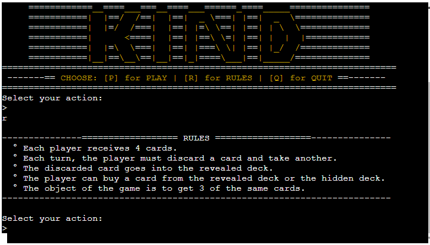

#### __Quit__

- When you execute the exit option, the program will be closed. It will no longer give the player the option to execute any commands, only after restarting the page or through the run button

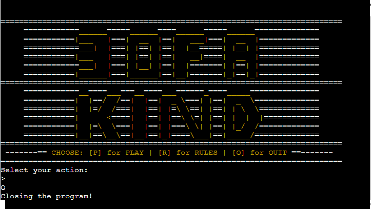

#### __Flip Coin__

- Is executed right after the player chooses option __[P]__ to play. Before starting he must choose between heads or tails to decide if he will start or if it will be the machine. It has the options __[H]__ for heads or __[T]__ for tails.

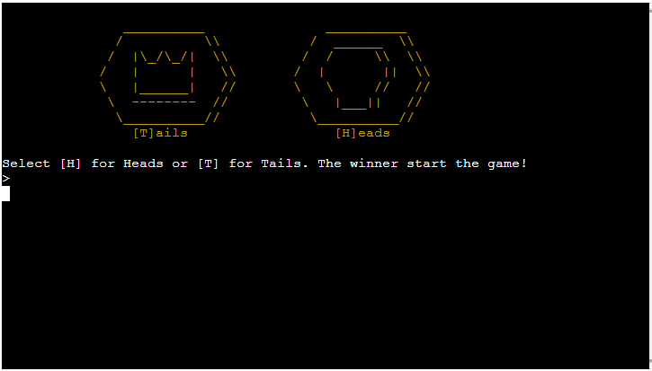

- The program tosses the coin and returns 50/50 odds. If the selected option is the result, it will return a win message to the player. The image of the result will always be shown on the terminal.

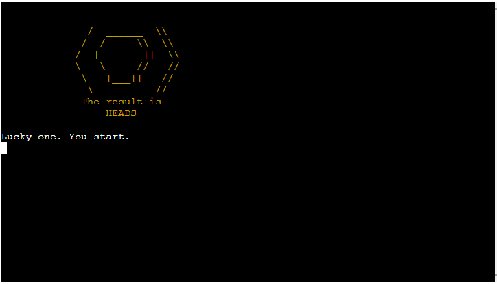

- If the selected option is not the one chosen by the player, the result of the coin toss will be displayed on the screen. And the message that the choice was not the right one. Then the computer will start the game.

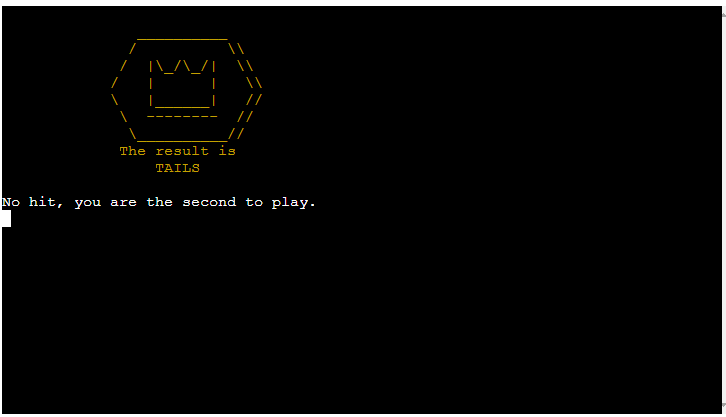

#### __Game__

The game displays on the terminal in the following order from top to bottom. 
- First the hand hidden from the computer with the 4 cards.

- The table showing the two decks (main and discard decks) with the option for each one below it along with a card counter, in the middle of the decks is the score counter and at the end on the right are revealed even more 4 cards besides the revealed deck. 

- The player's hand with the 4 visible cards to decide the plays, with the selection options for each one below.

- And finally the text describing the player's or computer's current move.

- __Player__

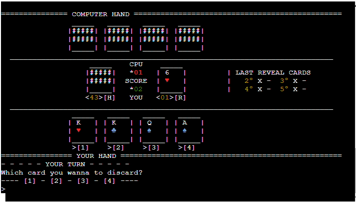

- The player has two screens for his moves, the first is the selection for the discard, where the player must choose which of the 4 cards he wishes to discard. The discarded card will be placed in the revealed deck, where the next player can pick it up if it is useful.
- The options for the selection are given in ordered numbers, being __[1]__, __[2]__, __[3]__ or __[4]__. By selecting the option the card will be removed from the hand and will not appear on the next screen of the terminal.

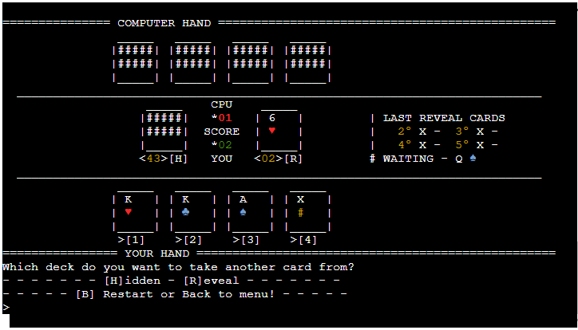

- After the discard action, the player must choose which card to buy. You have two options to select from, the main deck identified as __[H]__ for hidden and the discard deck that is face up, identified as __[R]__ for revealed.
- Each action takes the last available card at the top of each deck. The card discarded by the player in the previous action is described separately from the discard deck, until the end of the player's purchase action

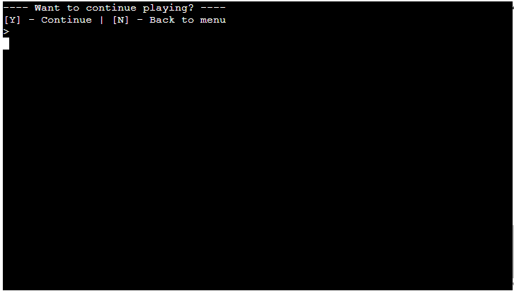

- __Computer__

- After the player's two choices, the computer will run the code and decide what action to take. It first separates the cards in the hand into potential winning and discarding options. Then it compares the cards in the hand to discard and then draw the card with the most potential to win.
- I used the time library to add a delay to the computer's play, so that the game would have better dynamics.

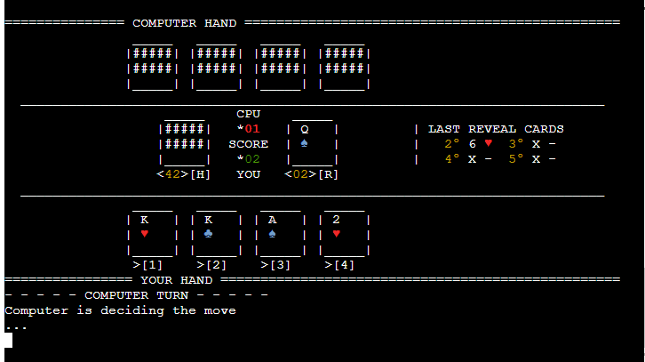

- __Win / Loss__

- At each hand played, the function to check the winner checks both hands and returns whether the player was the winner or the loser of this game.

- A message is printed on the terminal and the computer's hand is revealed, in both cases (victory or defeat). The point counter adds one point for each game. The score is reset to zero when the player goes back to the main menu and starts the game again.

- A question is printed asking whether the player would like to continue playing, or whether he or she wants to return to the main menu. The options are __[Y]__ for yes, continue playing, and __[N]__ for no and return to the menu.

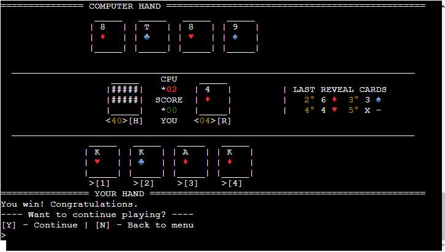

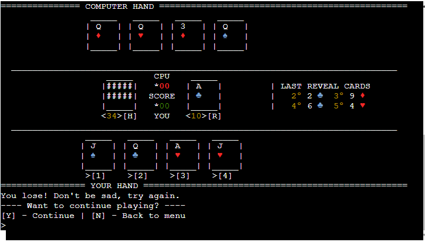

### Features Left to Implement

- To be implemented in the future, I am thinking about the possibility of adding a ranking that receives the player's name and the player's victory and defeat points. This ranking would be accessed from the menu to encourage players to try to beat the records.

## Testing

During these tests the size of the displays were adjusted, when to clean the terminal to keep the game fixed. In the end I found what I believe to be the most pleasing and intuitive look for the scope of a terminal-based game.

### Funcionality

Once the game was finished, I played it several times to find possible flaws or errors that could compromise the gameplay or interrupt the game. 
All commands are responding as they should, when some wrong selection is sent to the terminal, the answers are appearing to the user.
So far, when I finished and made the final deployment, the game is responding with no apparent errors.

### Navegation and Devices

With the project finished, I performed several tests on different browsers and different computers to check the playability and possible faults. No errors were presented during these tests

- __Desktop__
  - Sony Vaio (Laptop)
  - Dell XPS (Laptop)
  - Asus Chromebook (Laptop)
  - Macbook Air (Laptop)
  - HP (CPU)

- __Browsers__
  - Chrome
  - Firefox
  - Safari
  - Edge

### Validator Testing

- __Pyhton__
- I tested the code through PEP8 and no significant errors were presented.

### Other Tests

### User Story Testing

### Fixed Bugs

### Unfixed Bugs
    
## Deployment

### Deployment

- After finishing developing the program I deployed it on Heroku following this steps:

1. Create an account if you don't have and login into Heroku website
2. After loged in, you should click on *"New -> Create new app"* button
3. Insert your app's __Name__ (need be unique), then you need to __Choose__ your region, at the end click at the "Create App" button
4. Navigate into the Settings tab, and go to "Config vars" section, then go to *"Reveal Config Vars"*
5. Enter the __PORT__ in the KEY section and __8000__ for its value, then click *"Add"*
6. Next you need to go to *"Buildpacks"* section and click "Add buildpack"
7. Firstly add the *Python* buildpack then *NodeJs*, need to be on that order
8. Navigate to the *"Deploy"* tab, and select Github as the deployment method
9. You need to look for your repository name and select the option Connect
10. You can choose between two deployment options for your app to Heroku (Automatic or Manual).
	- With automatic deploys enabled, your app will be updated each time a change has been pushed to the repository
	- With manual deploys, your app will be updated only when you manually click to deploy it
11. After this steps the deploying is finished, a link will be provided to you for accessing your app

### Fork

- Forks let you make changes to a project without affecting the original repository. Follow this steps:
1. Go to the repository page, can be accessed [here](https://github.com/guisgrande/third-project-ci).
2. On top right, you select the Fork option and proceed.
3. A duplicate will be created inside your repository.

### Clone

- Clone let you create an identical repository to the original. Follow this steps:
1. Go to the repository page, can be accessed [here](https://github.com/guisgrande/third-project-ci).
2. Click on code drop down menu.
3. Choose if you want to clone using HTTPS, SSH or GitHub CLI. Then select de copy button.
4. Open your Git Bash in your IDE.
5. Type git clone and then paste the URL you copied before.
6. Press Enter to create your clone.

## Technologies and tools

- Programming languages used: Python 3.6
- [Gitpod](https://www.gitpod.io/) - Used to create/edit the code of the project.
- [Github](https://github.com/) - Used to create repository, hosting files and deployment of the website.
- [Heroku](https://heroku.com/) -  Used to deploy the project
- [Ludichart](https://www.lucidchart.com/) - Used to create the flowchart.
- [PEP8](http://pep8online.com/) - Used to test/validate Python code.

## Credits

### Inspiration
 
 - I used the content on this webpage to help implement the colors in the terminal (It is in Portuguese). [Website](https://raccoon.ninja/pt/dev-pt/utilizando-cores-para-escrever-no-terminal-python)
 - I used the content on this Stack Overflow question, to implement at my project to clear the terminal. [Website](https://stackoverflow.com/questions/2084508/clear-terminal-in-python)

## Acknowledgements

- Code Institute for all the support and the team always ready to help.
- My mentor [Ben Kavanagh](https://github.com/BAK2K3) for all the instructions, advice and knowledge that helped me to improve the project.
- My parents, my wife and my friends for motivating me to achieve my best.
- Everyone in the Slack community for tips and opinions. 
